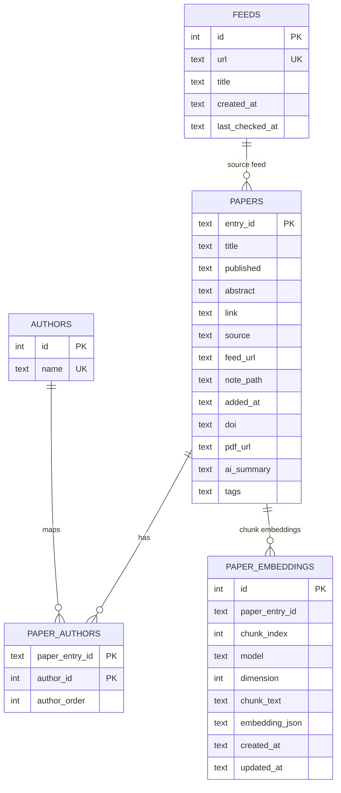
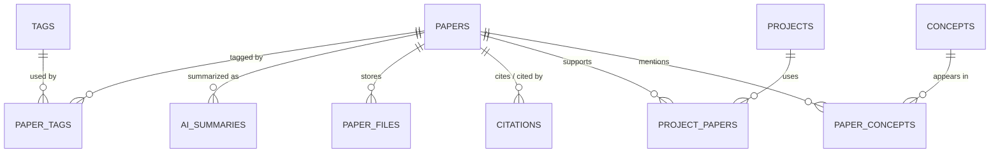

# ER Model

## Current implemented schema

## OpenAI + vector retrieval design

- OpenAI creates embeddings outside the DB layer.
- `paper_embeddings` is the canonical store for embedding payloads and chunk text.
- `vec_paper_embeddings` is an optional acceleration index when `sqlite-vec` is installed.
- Semantic retrieval first tries `sqlite-vec`; otherwise it falls back to Python cosine similarity on `paper_embeddings`.
- The application currently assumes one active embedding dimension per vector index.

## Recommended next-step research schema

## Practical recommendation

For the next iteration, keep this split:

1. Bibliographic truth in `papers`.
2. LLM-generated text in a future `ai_summaries` table.
3. Retrieval text chunks in `paper_embeddings`.
4. Fast ANN index in `sqlite-vec` only as a derived structure.

That separation will make future model migrations and re-embedding runs much less painful.
