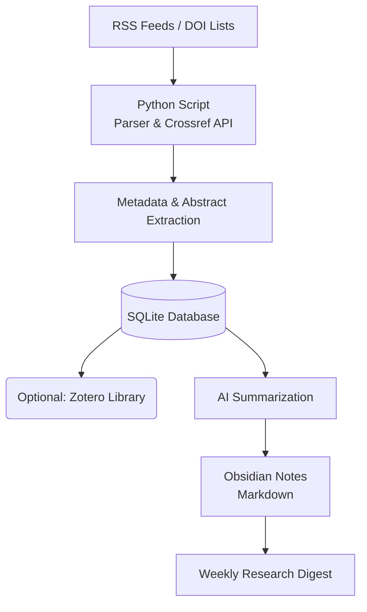
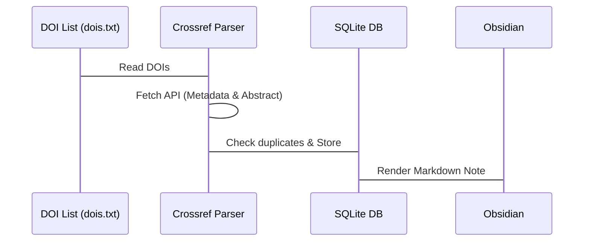

# 🚀 Research Automation Plan

> 建立一套可持續運作的研究工作流程，使 **新論文能自動被發現、整理並轉化為知識筆記**。
> 核心概念是讓 **腳本 (Script) 直接讀取 RSS feed 以及 API**，不再高度依賴傳統的 RSS Reader。

---

## 🏛️ System Architecture



### 🛠️ 核心工具 (Core Stack)
- **Feed Parsing & API:** Python `feedparser`, `requests`
- **資料庫 (Database):** SQLite (支援 local vector search)
- **文獻管理 (Reference Manager):** Zotero
- **知識庫 (Knowledge Base):** Obsidian
- **自動化 (Automation):** cron / GitHub Actions

---

## 🗺️ Phases Overview

| Phase | Title | Goal | Scope |
| :---: | :--- | :--- | :--- |
| **1** | [RSS Infrastructure](#phase-1---rss-infrastructure) | 建立自動文獻來源 | 收集 RSS、Parse、去重 |
| **2** | [Literature Capture](#phase-2---literature-capture) | 轉化儲存 | 輸出 Markdown 至 Obsidian |
| **3** | [Literature Management](#phase-3---literature-management-optional) | 整合文獻庫 | 串接 Zotero API |
| **4** | [AI-assisted Reading](#phase-4---ai-assisted-reading) | 降低閱讀成本 | GPT 總結重點、研究貢獻 |
| **5** | [Knowledge Base Integration](#phase-5---knowledge-base-integration) | 沉澱研究知識 | Literature → Concept → Idea |
| **6** | [Weekly Research Digest](#phase-6---weekly-research-digest) | 定期回顧 | 自動生成每週文獻週報 |
| **7** | [Retrospective Data Ingestion](#phase-7---retrospective-data-ingestion-new-) | 歷史資料收錄 | 透過 DOI 溯源補齊舊論文 |

---

## 📌 Phase 1 — RSS Infrastructure
### Goal: 建立自動文獻來源

**1. 收集 RSS Feeds**
來源涵蓋重要期刊、Google Scholar Alerts、Conference Feeds、arXiv Categories。
將清單統整於 `feeds.txt`。

```text
# Example feeds.txt
MIS Quarterly RSS
Information Systems Research RSS
Decision Support Systems RSS
Google Scholar keyword alerts
```

**2. 建立 RSS Parsing Script**
使用 Python `feedparser` 定期抓取 RSS entries 並抽取關鍵 Metadata：
- `title`, `authors`, `date`, `abstract`, `link`, `source`

**3. 去重與記錄**
建立 SQLite Database 進行狀態管理，避免同一篇文章被重複處理與分析。

---

## 📌 Phase 2 — Literature Capture
### Goal: 將 RSS 文章轉成可保存的本機資料

每篇文章將由腳本自動生成符合 Obsidian 格式的 Markdown 筆記，存放於 `vault/literature/`：
```text
YYYYMMDD-title-slug.md
```

**Markdown Template:**
```markdown
---
title: "Paper Title"
authors: ["Author A", "Author B"]
source: "Journal Name"
published: "YYYY-MM-DD"
url: "https://..."
doi: "10.1xxx/..."
pdf_url: "https://..."
tags: ["rss", "paper"]
---

# Paper Title

## Abstract
...

## AI Summary
...

## Notes
...

## Relevance to Research
...
```

---

## 📌 Phase 3 — Literature Management (Optional)
### Goal: 整合文獻管理系統

串接 **Zotero API**，完善書目管理：
1. Script 抽取 DOI 或 PDF
2. 推送至 Zotero 抓取完整 Citation Metadata
3. 實現 PDF 同步存儲、Tagging 與 Deduplication

---

## 📌 Phase 4 — AI-assisted Reading
### Goal: 減少閱讀成本，加速重點抓取

結合 OpenAI API 進行內容分析：
1. **Abstract Summary** (摘要濃縮)
2. **Methodology Classification** (方法分類)
3. **Research Contribution** (研究貢獻整理)

**Prompt 範例：**
```text
Summarize this paper for an information systems researcher.
Provide:
- Research Question
- Theoretical Background
- Method & Dataset
- Key Findings
- Contribution
```
_AI 的總結結果將直接寫入 Obsidian 的 Literature Note 中。_

---

## 📌 Phase 5 — Knowledge Base Integration
### Goal: 將零碎文獻轉為有價值的研究知識

**Obsidian Vault Structure:**
```text
vault/
 ├─ literature/    # 原始文獻筆記 & AI 摘要
 ├─ concepts/      # 理論與概念卡片
 ├─ methods/       # 研究方法筆記
 ├─ projects/      # 進行中的研究專案
 └─ weekly-notes/  # 研究週報
```

**閱讀與轉化流程：**
`Literature Note` ➔ `Concept Note (Zettelkasten)` ➔ `Research Idea`

---

## 📌 Phase 6 — Weekly Research Digest
### Goal: 每週整理研究進展，保持研究動能

由 Script 自動結算並生成 `weekly-digest.md`：
- **New papers this week**: 本週新收錄文獻清單
- **Key findings**: 重點文獻摘要總結
- **Potential citations**: 可用於目前專案的潛在引用
- **Research ideas**: 衍生的研究想法

_(可選：整合 Email 發送或直接寫入 Obsidian Weekly Note)_

---

## 📌 Phase 7 — Retrospective Data Ingestion (New ✨)
### Goal: 歷史文獻溯源與資料庫整合

針對過去數十年間已發表，或手邊既有的論文集合，透過 DOI 直接溯源，將這些歷史資料庫整併至目前自動化流派中的 SQLite DB 中。

**機制 (Mechanism):**
使用 **Crossref API** 自動取得出版商端提供的 Metadata。

**工作流程:**

> **💡 Value:** 使用者不必完全依賴最新出版的 RSS，能無縫轉移及收錄自己在舊有或其他資料庫中的文獻紀錄。

---

## ⚙️ Automation & Deployment

### Local Cron Job (Mac/Linux)
每天早上 9 點自動執行：
```bash
0 9 * * * /path/to/venv/bin/python -m research_agent.cli run --days 7
```

### GitHub Actions (Cloud)
每日定時同步 RSS：
```yaml
schedule:
  - cron: "0 23 * * *"
```

---

## 🎯 Expected Benefits
系統建置完成後，將提供：
1. 🔄 **自動文獻追蹤:** 不漏接關鍵期刊最新發表。
2. 🔍 **可搜尋的文獻筆記:** 全部 Markdown 化，Local 隨時檢索。
3. 🤖 **AI 輔助閱讀:** 快速過濾不相關論文。
4. 💡 **研究 Idea 累積:** 建立個人的知識複利網路。
5. 📊 **每週研究摘要:** 定期產出進度，降低研究焦慮。

---

## 🗓️ Development Roadmap

- [x] **Week 1:** 收集 RSS feeds、建立 RSS parser、成功輸出 Markdown。
- [x] **Week 2:** 建立 Obsidian vault 結構、資料庫去重機制 (SQLite)。
- [x] **Week 3:** DOI extraction、Crossref API 歷史資料爬梳 (Phase 7)、CLI 工具建置。
- [ ] **Week 4:** AI summarization (Phase 4)、Weekly digest (Phase 6)、Semantic Search 整合。

### 🚀 Long-term Extensions
- Citation network analysis
- Literature trend detection
- Automatic literature review drafting
- Research idea recommendation
